# 🌈 彩虹外链网盘

基于彩虹外链云盘二开 + 美化

- 本项目开源地址：<https://github.com/hefollo/pan>
- 原开源项目地址：<https://github.com/netcccyun/pan>

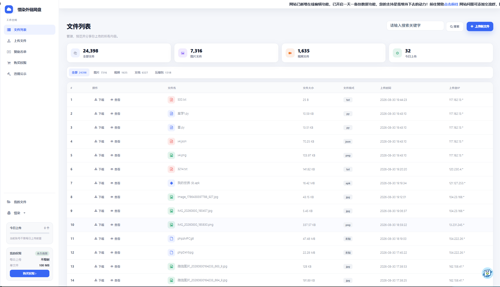
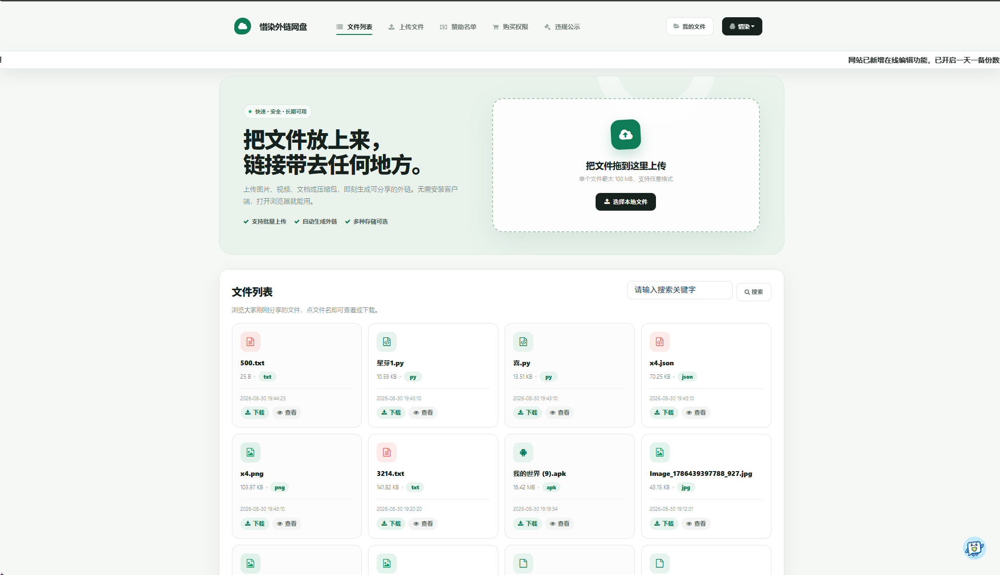
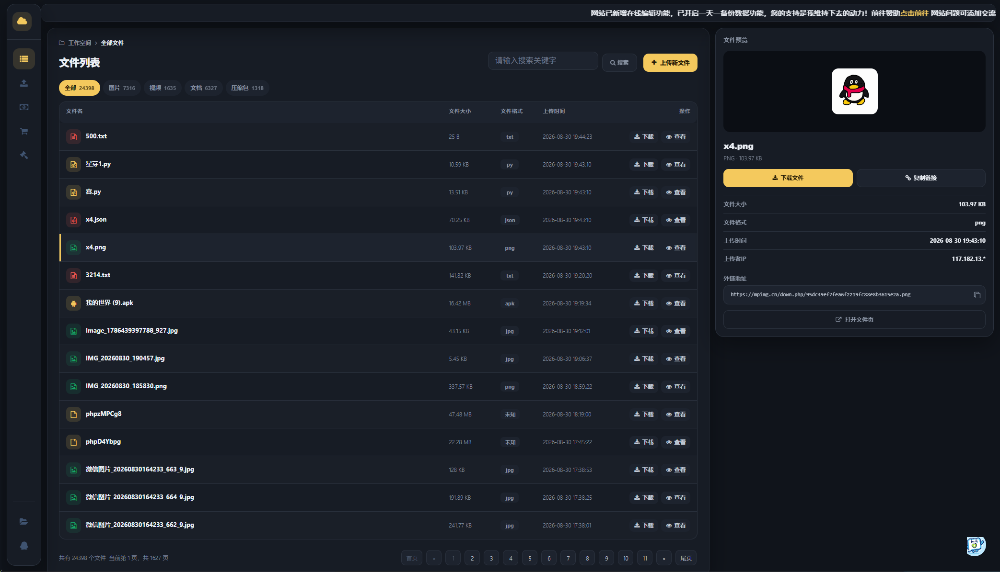


## 项目介绍

彩虹外链网盘是一款基于 PHP 开发的网盘与外链分享程序，支持多种类型文件上传，并可生成对应的外链地址，适用于文件分享、图床、音视频外链等多种使用场景。

本项目是在开源版本基础上进行二次开发与界面美化的版本，保留了原有核心功能，并在外观、用户体系、付费权限、邮件通知等方面做了扩展。

## 功能一览

**文件与外链**

- 支持所有常见格式文件上传，可多选批量上传、Ctrl+V 粘贴上传、拖拽上传
- 生成文件外链、图片外链、音乐外链、视频外链，并同时给出 UBB 代码和 HTML 代码
- 文本、图片、音乐、视频在线预览，TXT 等文本内容在线查看
- 文件内容在线编辑，支持 `txt`、`md`、`json`、`js`、`css`、`html`、`xml`、`csv`、`ini`、`yaml`、`sql`、`vue`、`ts` 等格式
- 覆盖上传：用新文件替换已有文件，对外链接保持不变
- 上传时可设置访问密码、可选择是否在首页文件列表公开
- 文件列表支持关键字搜索、按类型筛选，加密文件带锁形标记
- 可作为网盘使用，也可作为图床或音乐在线试听网站使用

**用户与登录**

- QQ / 微信快捷登录
- 邮箱注册与登录：填邮箱收验证码即可注册，支持算术验证码
- 用户管理：可区分普通 / 高级用户，单独设置每日上传数量、单文件大小、权限有效期，支持封禁、解封、查看用户文件、删除用户

**付费与运营**

- 购买权限：把上传额度做成套餐出售，付款成功后权限立即生效
- 支付宝当面付、易支付两种收款方式，可只开一种或同时开启
- 订单记录：按状态筛选、查看累计金额、补发权限、清理未支付订单
- 赞助页与赞助名单

**邮件**

- 四种发信通道可选：SMTP、Resend、Brevo、SendGrid，可同时勾选多个
- 后台一键测试发信，失败时显示具体原因
- 发信记录：每封验证码邮件的发送结果、通道、来源都有据可查

**存储与安全**

- 支持本地存储及阿里云 OSS、腾讯云 COS、华为云 OBS、又拍云、七牛云、通用 S3 兼容存储
- 图片违规检测，可对接阿里云 / 腾讯云内容安全
- 违规文件公示，向访客公开已封禁文件的处理情况
- 覆盖记录审计，管理员可复查每一次内容替换
- 每日上传数量与每分钟上传次数限制

**界面**

- 19 套外观：15 套配色型 + 4 套布局型，前台、后台、公告条、赞助页、弹窗全部联动
- 广告公告位设置，可自定义顶部公告与首页广告位
- 手机端适配

## 界面预览

### 前台

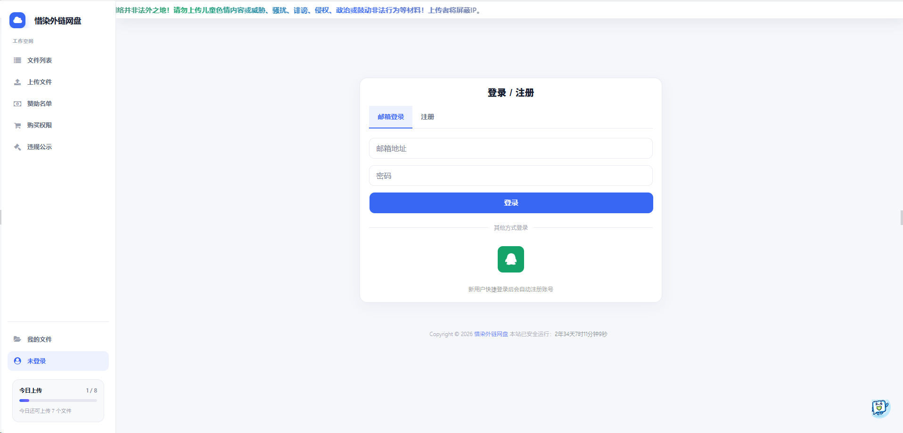
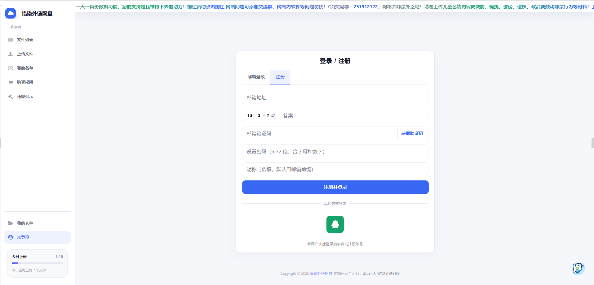
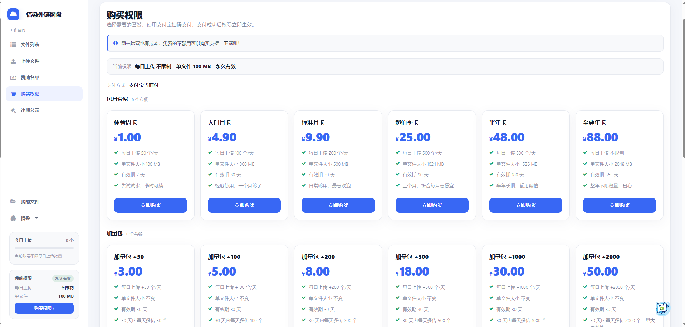

### 后台

**后台首页**

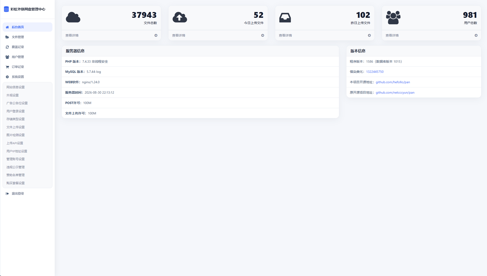

**文件管理**

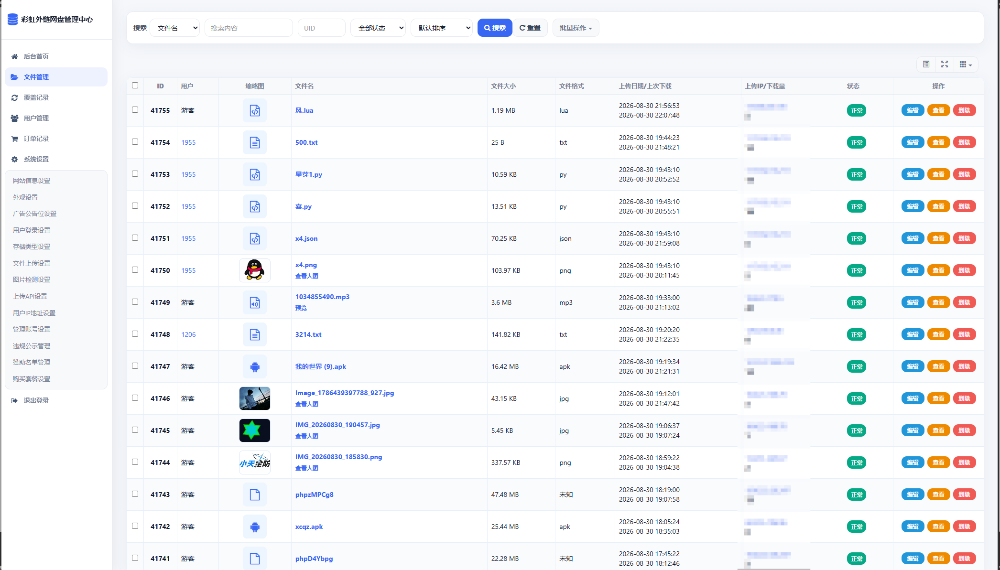

**用户管理**

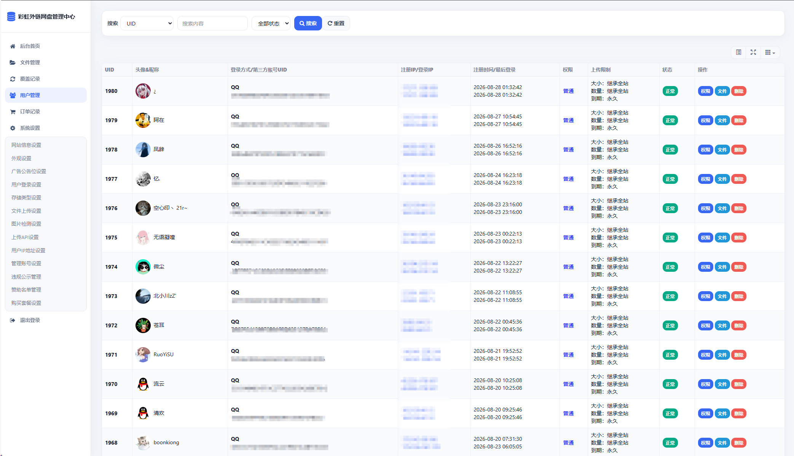

**覆盖记录**

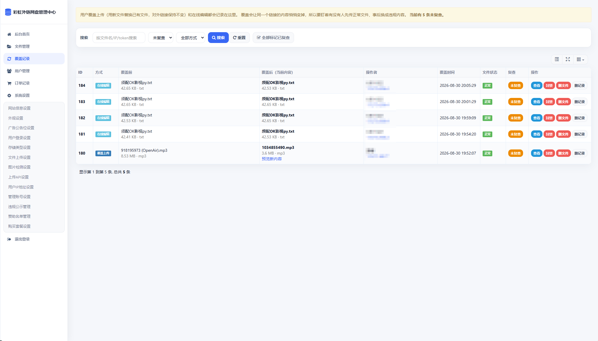

**外观设置**

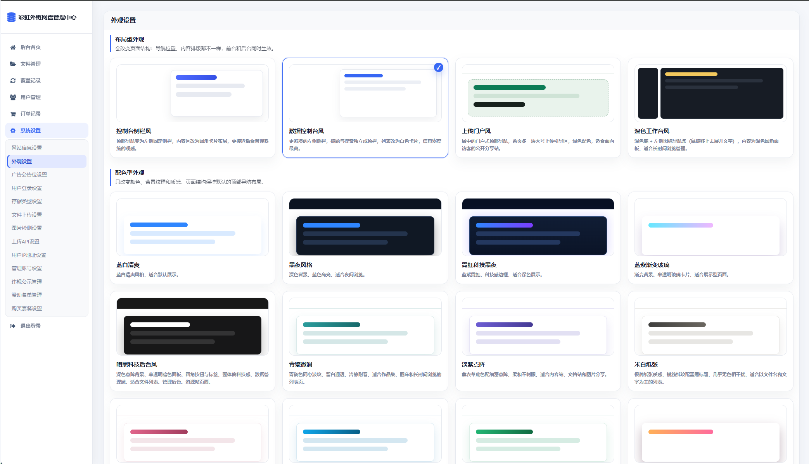

**购买套餐设置**

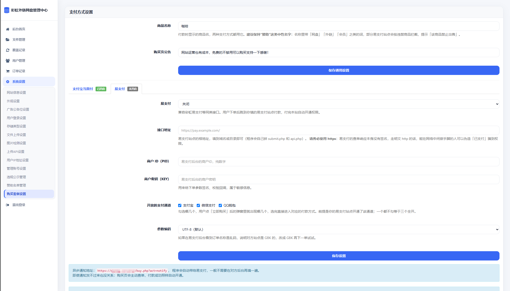
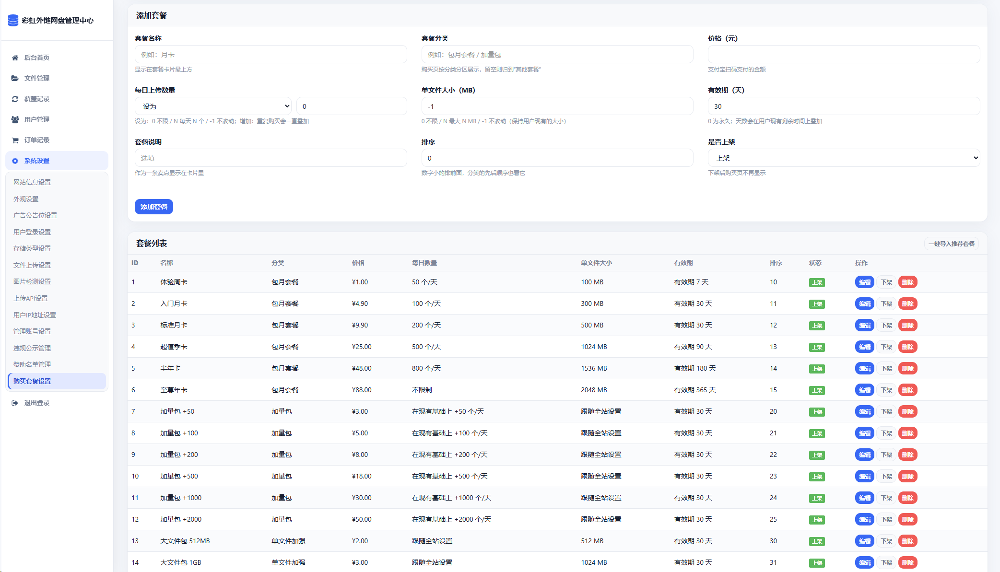

**订单记录**

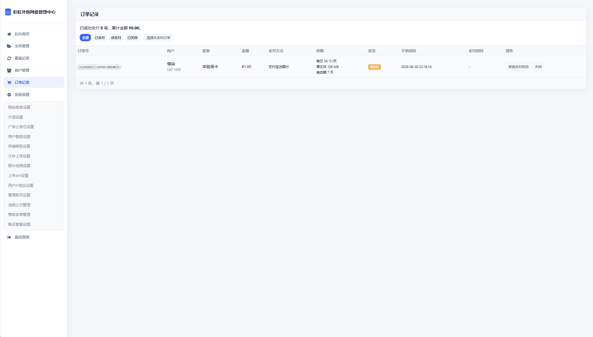

**邮件发信设置**

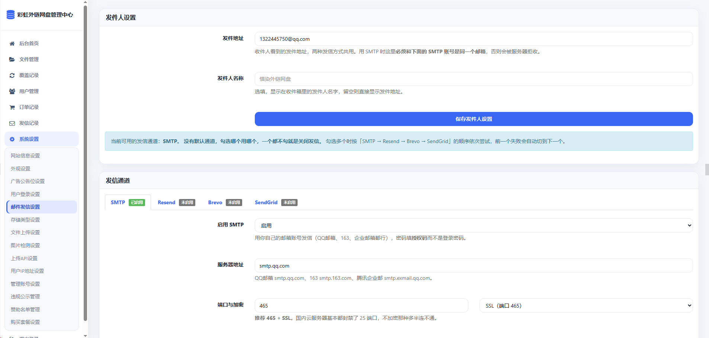
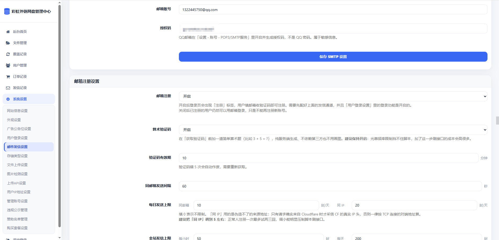
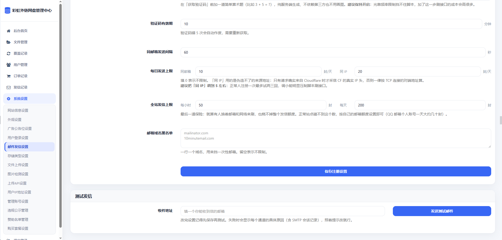

**发信记录**

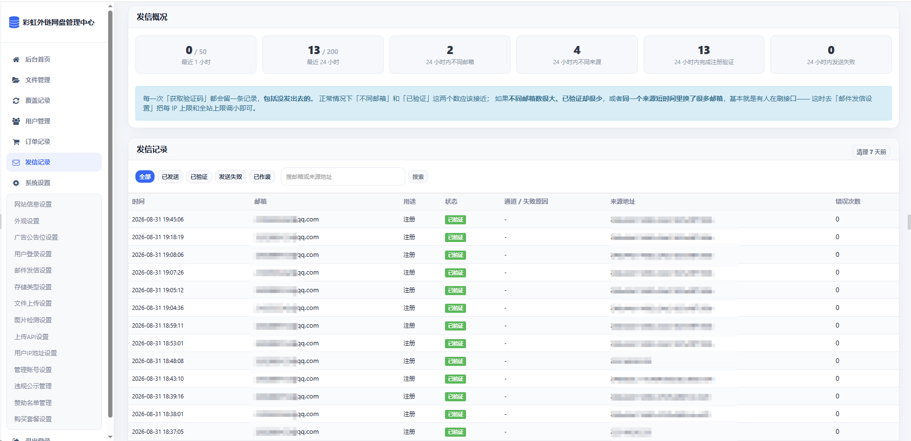

**用户 IP 地址获取设置**

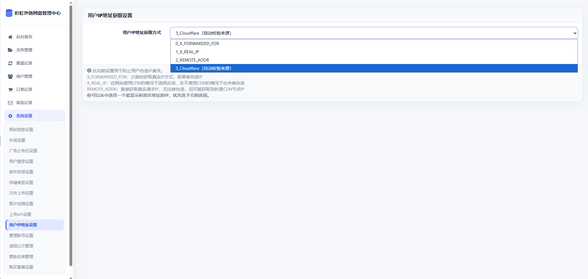

## 外观主题

后台「系统设置 - 外观设置」可切换 **19 套**外观，前台页面、后台管理界面、顶部公告条、友链广告位、赞助页和各类弹窗会一起联动。

外观分成两类：**布局型**改的是页面结构（导航位置、内容排版），**配色型**只改颜色和质感、保持默认的顶部导航布局。

### 布局型外观（4 套）

| 外观 | 结构 | 后台 |
| --- | --- | --- |
| 控制台侧栏风 | 顶部导航变为左侧固定侧栏，内容区为圆角卡片布局 | 同步改为侧栏 |
| 数据控制台风 | 更紧凑的侧栏，标题与搜索独立成顶栏，文件列表上方增加统计卡与类型筛选 | 同步改为侧栏 |
| 上传门户风 | 居中的门户式顶部导航，首页增加大号上传引导区，文件列表改为卡片网格 | 只换配色，保留顶栏 |
| 深色工作台风 | 深色底 + 72px 图标导航条（鼠标移上去展开文字），右侧常驻文件预览面板 | 同步改为侧栏 |

三套侧栏外观的侧栏底部会显示「今日上传」和「我的权限」两张卡片；其余外观则在文件列表页和上传页顶部显示一条权限条，内容一致。

### 配色型外观（15 套）

**深色系**

| 主题 | 风格 |
| --- | --- |
| 黑夜风格 | 深色背景、蓝色高亮，适合夜间浏览 |
| 霓虹科技黑夜 | 蓝紫霓虹、科技感边框 |
| 暗黑科技后台风 | 深色点阵背景、半透明暗色面板，偏数据管理感 |

**浅色系**

| 主题 | 风格 |
| --- | --- |
| 蓝白清爽 | 默认主题，蓝白配色 |
| 青瓷微澜 | 青瓷色同心波纹，留白通透 |
| 淡紫点阵 | 薰衣草底色配细密点阵 |
| 米白纸张 | 极简纸张质感，横线纸纹配墨黑标题 |
| 淡粉暖调 | 浅粉底色配玫瑰色高亮 |
| 天蓝细纹 | 青蓝色调配斜向细纹 |
| 薄荷蜂巢 | 薄荷绿蜂巢暗纹 |

**毛玻璃系**

采用多层网格渐变背景叠磨砂玻璃面板，带内侧高光描边与彩色辉光。

| 主题 | 风格 |
| --- | --- |
| 蓝紫渐变玻璃 | 蓝紫渐变，半透明玻璃卡片 |
| 落日熔金 | 珊瑚橙到品红的落日渐变，浓烈张扬 |
| 深海玻璃 | 深海蓝绿渐变配青色辉光，通透安静 |
| 翡翠流光 | 翡翠绿到松石色，清透有质感 |
| 樱雾玻璃 | 粉紫到天青的浅色雾面渐变，轻盈明亮 |

## 用户登录与注册

后台「系统设置 - 用户登录设置」控制登录功能总开关，「邮件发信设置」里控制邮箱注册。

- **QQ / 微信快捷登录**：配置快捷登录接口后可用，新用户登录后自动注册账号
- **邮箱注册**：填邮箱 → 收 6 位验证码 → 设置密码 → 注册完成并直接登录
- **算术验证码**：获取验证码前需要算一道简单算术题（如 `5 + 3 = ?`），可在后台关闭
- 两种方式可以并存，登录页会自动显示可用的入口

后台可配置验证码有效期、同邮箱发送间隔、每日发送上限、全站发信上限，以及一次性邮箱域名黑名单。

## 邮件发信

后台「系统设置 - 邮件发信设置」，用于发送注册验证码。

| 通道 | 说明 |
| --- | --- |
| SMTP | 填自己的邮箱账号和授权码，QQ 邮箱、163、企业邮箱都可用 |
| Resend / Brevo / SendGrid | 走 HTTPS 接口发信，不受服务器封禁邮件端口的影响 |

- **没有默认通道**，勾选哪个用哪个，一个都不勾就是关闭发信
- 勾选多个时按顺序依次尝试，前一个失败自动切到下一个
- 页面底部可以**测试发信**，填一个邮箱点一下就知道通不通，失败时显示具体原因

「发信记录」页记录每一次验证码发送：时间、邮箱、用途、状态（已发送 / 已验证 / 发送失败 / 已作废）、通道或失败原因、来源地址。顶部还有最近 1 小时、24 小时的发送量与上限对比，方便判断接口有没有被滥用。

## 购买权限

站点可以把上传额度做成套餐卖给用户，付款成功后权限立即生效，全程不需要人工介入。后台入口在「系统设置 - 购买套餐设置」和「订单记录」，前台入口是导航栏的「购买权限」。

### 支付方式

两种可以只开一个，也可以同时开着让用户在购买页自己选。

| 方式 | 流程 | 需要填写 |
| --- | --- | --- |
| 支付宝当面付 | 页面内直接出二维码，扫码付款 | 应用 ID、支付宝公钥、商户应用私钥 |
| 易支付 | 点「立即购买」后弹窗选支付宝 / 微信 / QQ钱包，跳转到收银台 | 接口地址、商户 ID(PID)、商户密钥(KEY) |

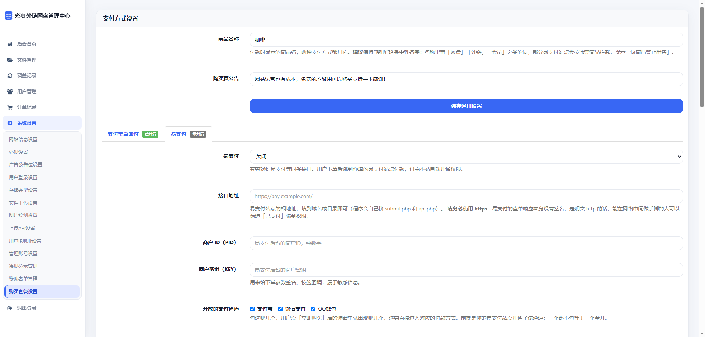

还可以设置付款时显示的商品名称、易支付开放哪几个支付通道，以及购买页顶部的公告文字。

### 套餐

套餐在后台自由增删改，支持按分类分区展示。程序内置一套 24 个推荐套餐，点「一键导入推荐套餐」即可导入（同名自动跳过），导入后价格和额度随便改。

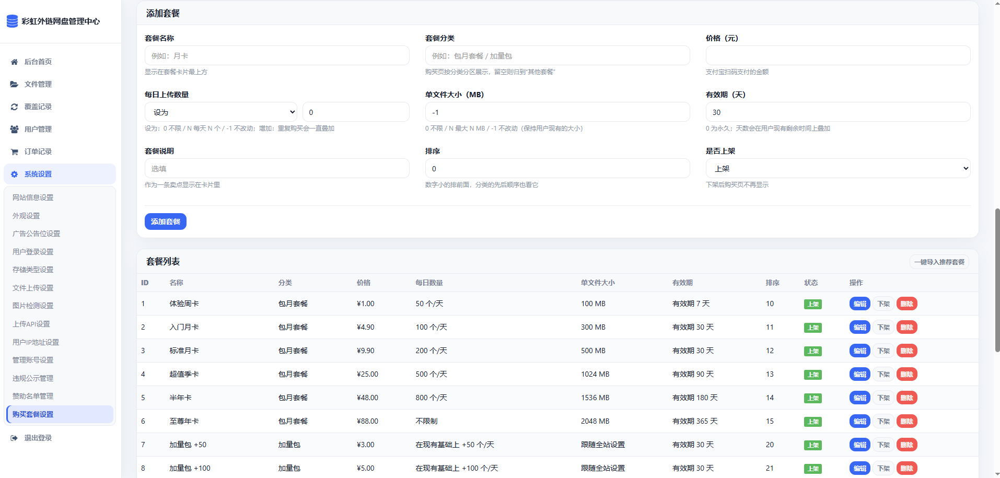

每个套餐可以单独设置每日上传数量、单文件大小和有效期，组合出四类套餐：

- **时长套餐**（周卡 / 月卡 / 季卡 / 半年卡 / 年卡）：换成该套餐的额度，天数在剩余时间上叠加
- **加量包**：只增加每日数量，重复购买一直累加，不会被之后购买的时长套餐覆盖
- **单文件加强包**：只提升单文件上限，不动每日数量
- **永久会员**：一次买断，不再有到期时间

购买页会显示购买后的实际额度；买了不会带来任何提升的套餐会直接提示并拦下，不让用户白花钱。

### 订单记录

按状态筛选、查看累计金额，每笔订单都能查询支付状态、补发权限或关闭，另有「清理未支付订单」一键清理废单。

## 上传限制

后台「系统设置 - 文件上传设置」可以设置：

- 全站每日上传数量、单文件大小上限
- 每分钟上传次数
- 允许 / 禁止的文件类型、文件名关键词过滤

登录用户按账号统计，游客按来源地址统计。用户的权限可以在「用户管理」里单独调整，也可以通过购买套餐获得。

站点如果套了 Cloudflare 或其它反向代理，需要在「系统设置 - 用户IP地址设置」里选对获取方式，页面上会直接显示每种方式当前取到的地址，对照着选即可。

## 违规文件公示

面向合规场景，把已封禁文件的处理情况对外公开。

- 前台入口在导航栏「违规公示」，地址 `/violation.php`
- 后台「文件管理」里封禁文件会自动生成公示记录，解封会自动撤下，批量操作同样生效
- 后台「系统设置 - 违规公示管理」可查看全部记录、修改文件名与备注、单条开关是否公示、手动补录或删除记录
- 支持一键导入历史已封禁文件
- 可在「网站信息设置」里关闭整个公示功能，并自定义公示页顶部的说明文字

公示页只输出脱敏信息：文件名打码、IP 只显示前两段，不输出文件哈希、下载链接或任何可访问地址。开启云端图片检测时，机器自动命中封禁的文件会留档但默认不公示，需人工确认后手动放出。

## 覆盖记录审计

用户的覆盖上传和在线编辑都会改变已有链接背后的内容，后台「覆盖记录」用于复查这类改动。

- 记录覆盖前后的文件名、大小、格式，图片可直接预览新内容
- 记录操作者 UID / IP、时间和方式（覆盖上传 / 在线编辑）
- 显示该文件当前状态（正常 / 待审 / 已封禁 / 已删除）
- 每条记录可直接查看、封禁、删除文件、标记已复查或删除记录
- 默认只显示未复查的条目，页面顶部提示积压数量，支持一键全部标记已复查

## 赞助页

- 赞助名单在后台「系统设置 - 赞助名单管理」维护
- 同一页面可配置微信、QQ 钱包、支付宝三张收款码，支持完整网址或相对 `includes/sponsor/` 的路径；某一项留空则赞助页上不显示该收款方式
- 赞助页配色跟随站点当前外观主题

## 访问链接

文件的对外链接使用独立的随机 token：

- 同一份内容被多人上传时，每个人都会得到独立的记录和独立的链接，各自的文件名、密码、隐藏设置互不影响，物理文件仍然只存一份
- 覆盖上传和在线编辑只会改变当前这一条记录指向的内容，不会连带修改其他人的文件
- 删除文件时，只有当没有任何记录再引用这份内容时，才会真正清理物理文件

## 支持的云存储

- 阿里云 OSS
- 腾讯云 COS
- 华为云 OBS
- 又拍云
- 七牛云
- 通用 S3 兼容存储

通用 S3 使用 AWS Signature Version 4 签名协议，可用于 AWS S3、MinIO、Cloudflare R2、Backblaze B2，以及其他兼容 S3 API 的对象存储服务。

### 通用 S3 配置

进入后台的「存储类型设置」，展开「通用 S3 兼容存储」，填写以下参数：

| 配置项 | 说明 |
| --- | --- |
| Access Key | 对象存储平台提供的访问密钥 ID |
| Secret Key | 对象存储平台提供的访问密钥密码 |
| Endpoint | S3 API 地址，需填写完整的 `http://` 或 `https://` 地址 |
| Region | Bucket 所在区域，例如 `us-east-1`；Cloudflare R2 通常填写 `auto` |
| Bucket | 存储桶名称 |
| 对象前缀 | 文件在 Bucket 内的目录前缀，默认是 `file/`；留空则使用根目录 |
| 地址风格 | 可选择虚拟主机风格 `bucket.endpoint` 或路径风格 `endpoint/bucket` |

常见配置提示：

- AWS S3：Endpoint 可填写对应区域的 S3 地址，Region 必须与 Bucket 实际区域一致
- MinIO：填写 MinIO API 地址和端口，通常选择「路径风格」
- Cloudflare R2：Endpoint 通常为 `https://<账户ID>.r2.cloudflarestorage.com`，Region 填写 `auto`
- Backblaze B2：填写平台提供的 S3 Endpoint，并使用该 Endpoint 对应的 Region
- 如果平台报 Bucket、域名或签名不匹配，可切换「地址风格」后重试

通用 S3 支持网站中转上传、POST Policy 浏览器直传、签名下载、断点下载、文件删除和文件信息读取。使用浏览器直传前，需要确认存储平台支持 S3 POST Policy，并为 Bucket 配置允许本站域名发起 `POST` 请求的 CORS 规则；部分平台不支持这种直传方式，此时请在后台选择「网站中转」。

## 环境要求

- PHP >= 7.1，需启用 cURL 扩展
- MySQL / MariaDB
- 当前程序版本 `VERSION` 为 `1612`，数据库版本 `DB_VERSION` 为 `1018`

## 安装与升级

全新安装访问 `install/` 目录按提示完成即可。

从旧版本升级时，覆盖程序文件后**必须**访问一次：

```
http(s)://你的域名/install/update.php
```

看到「网站数据库升级完成」即可。升级脚本会建表、补齐配置项，并把历史数据迁移到新结构。若跳过这一步，程序会因为数据库版本落后而提示「请先完成网站升级」。

> 静态资源由 `VERSION` 常量做缓存串（`style.css?v=1612`）。如果自行修改了 CSS/JS，记得同步提高 `includes/common.php` 里的 `VERSION`，否则浏览器会继续使用旧缓存；站点前面挂了 CDN 的还需刷新 CDN。

## 相较原版新增的内容

- 外观扩展至 19 套（15 套配色型 + 4 套布局型），前后台、公告条、赞助页及弹窗联动
- 新增邮箱注册与登录，含算术验证码与发信记录
- 新增购买权限模块：套餐管理、支付宝当面付与易支付、订单记录与对账
- 新增邮件发信设置，支持 SMTP 与三种 HTTP API 通道，可测试发信
- 新增用户管理与权限设置，可单独设置每位用户的额度与有效期
- 新增覆盖上传功能及配套的后台审计界面
- 新增违规文件公示功能
- 新增广告公告位设置
- 新增在线查看文本内容与在线编辑功能
- 新增通用 S3 兼容存储，可对接 AWS S3、MinIO、Cloudflare R2、Backblaze B2 等平台
- 文件访问链接改为独立 token，同内容多次上传互不干扰
- 上传限制新增每分钟次数，并可配置反向代理下的真实 IP 获取方式
- 前后台界面整体美化与手机端适配

## 致谢

感谢原开源项目 [netcccyun/pan](https://github.com/netcccyun/pan) 的作者提供基础程序支持。
